Sofia cristina Dos santos 
Aula: Banco de dados 

***Livraria***

Para realizar a atividade primeiro eu entrei no aplicativo root, entrei no postgres usando `sudo -u postgres psql`, para assim podem criar a pasta do arquivo sql. Eu deixei como livraria para facilitar
 
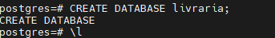

O comando ` \l`  eu usei para verificar se o arquivo havia sido criado corretamente.

Após criado eu desci o arquivo para o vs code e começei a fazer a minha tabela.

```sql
CREATE TABLE livros (
--     id SERIAL PRIMARY KEY,
--     titulo VARCHAR(100) NOT NULL,
--     autor VARCHAR(50) NOT NULL,
--     preco DECIMAL(10,2) NOT NULL,
--     genero VARCHAR(30) NOT NULL,
--     estoque INTEGER NOT NULL,
--     ano_publicacao INTEGER NOT NULL
-- );
```
Eu comecei usando o `CREATE TABLE` para criar a tabela e depois fui declarando as próximas colunas, (Título, Autor, Preço (eu deixei preco para não ter interferências depois)genero, estoque e ano publicação). Cada uma possui um tipo de carcteristicas por exemplo o preco é `DECIMAL` pois é numero. O parentêses (10,2) serve para declarar o limite maxímo de casa depois  e antes da virgula .O autor é `VARCHAR` porque é nome e pode ter até 50 letras. É muito importante e na hora as vezes eu confundia um pouco. Já o INTEGER é para ano.

---
Depois eu apenas colei as insformações que o professor passou, para a tabela ficando desta maneira: 

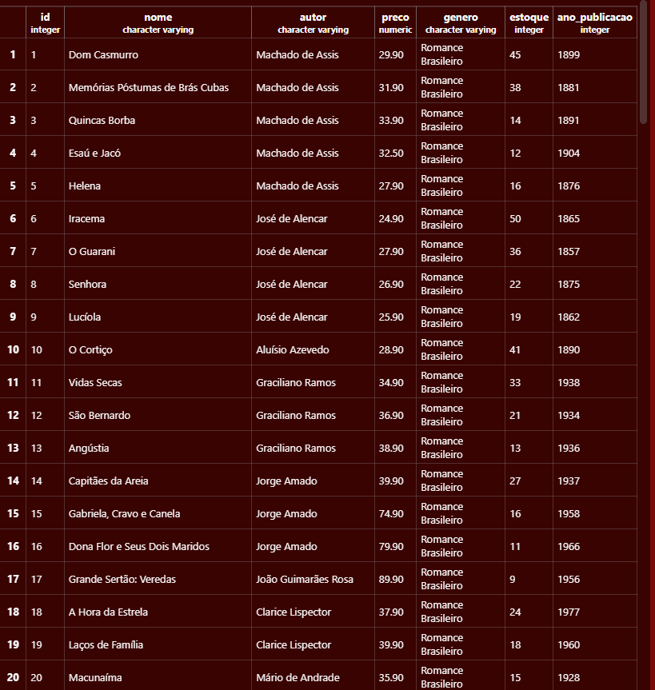
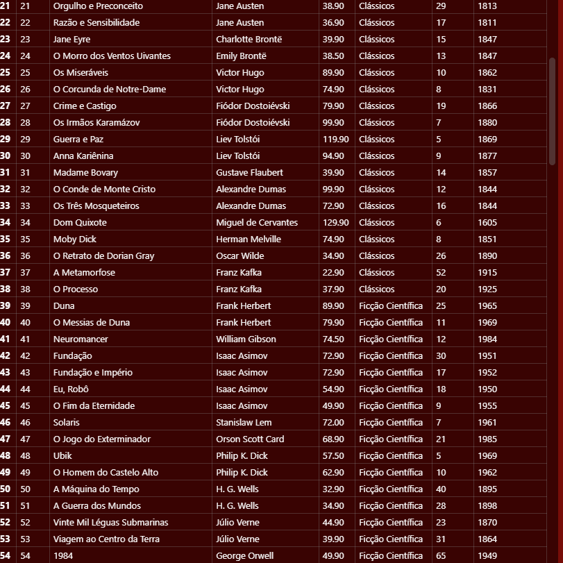
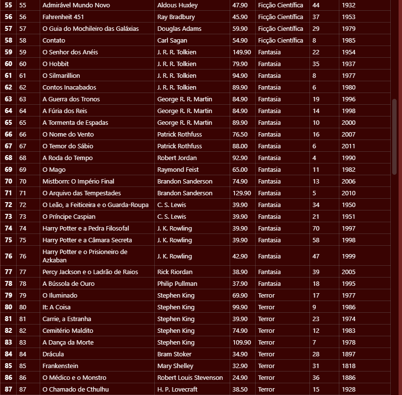
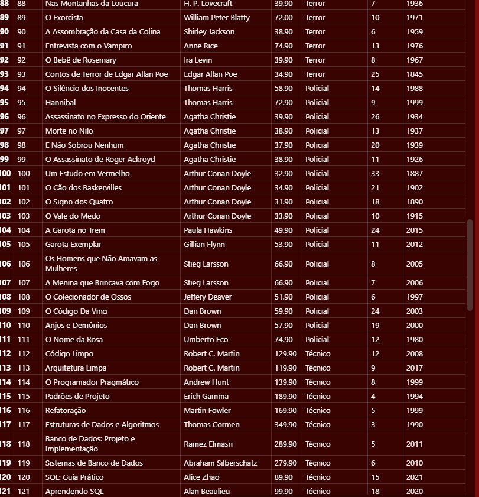
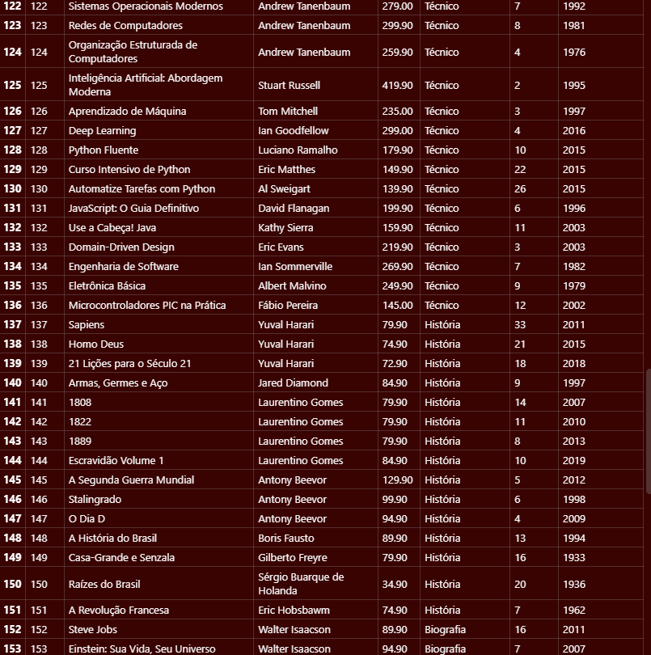
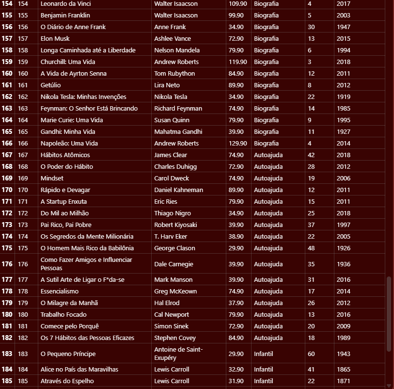
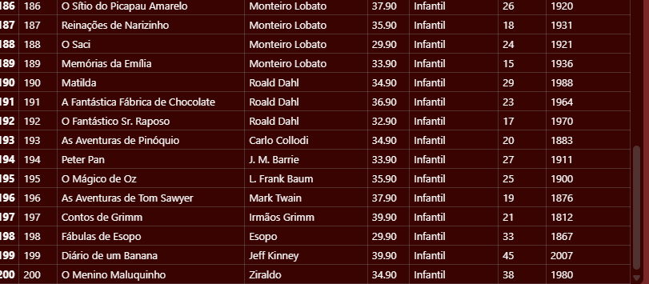

***2 passo:***

Para declarar os primeiros 10 produtos com todas as suas respectivas características eu usei:

```sql
SELECT nome,autor,preco,genero,estoque,ano_publicacao
FROM livros LIMIT 10;
```
---

***3 passo***

Para verficar a quantidade de generos por ordem alfabética eu usei o : 

```sql
SELECT DISTINCT genero
FROM livros
ORDER BY genero;
```
---

***4 Passo***

Para achar o tanto de autores eu usei:

```sql
SELECT DISTINCT autor FROM livros;
```
No final descobrimos que são 131

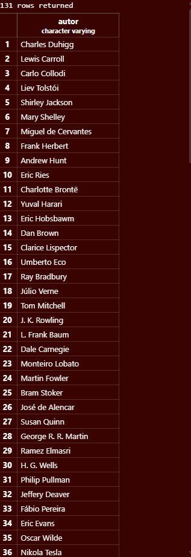
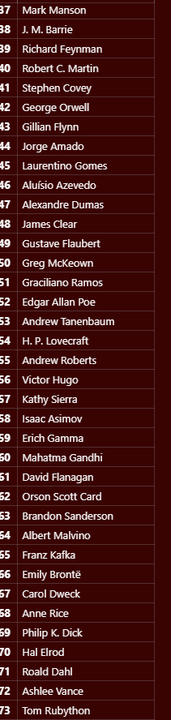
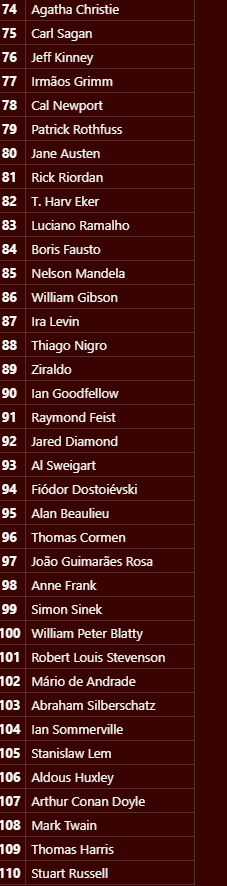
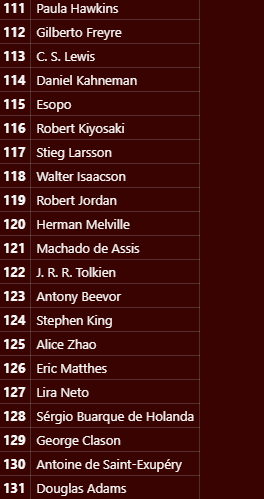

---

***5 passo:***

Para listar os cinco produtos mais caros eu usei o código:

```sql
SELECT nome, preco
FROM livros
ORDER BY preco DESC
LIMIT 5;
```
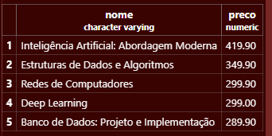

---

***6 passo:***

 Para Listar os 5 livros com menor estoque (nome e estoque) eu usei:

 ```sql
 SELECT nome, estoque
FROM livros
ORDER BY preco DESC
LIMIT 5;
```
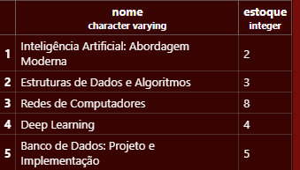

---

****Bloco 2 — Filtros numéricos****

>Objetivo: dominar os operadores de comparação e o BETWEEN.

***7 Passo:***

Para Mostrar titulo e estoque de todos os livros do gênero Técnico eu usei :

```sql
SELECT nome,estoque
FROM livros
WHERE genero = 'Técnico';
```
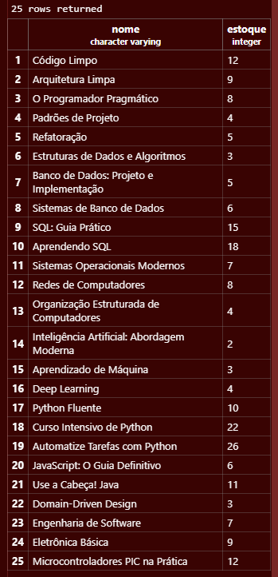

---

***8 passo:***
 Para Mostrar o titulo e preco dos livros que custam mais de R$ 200,00 eu usei:

 ```sql
SELECT nome,preco
FROM livros
WHERE preco >=200;
```
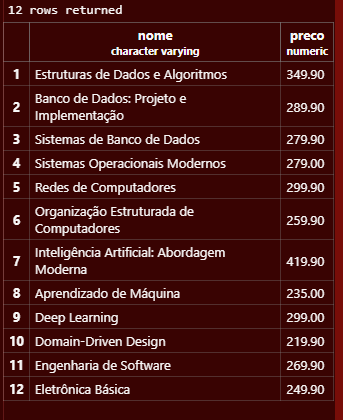

---

***9 Passo:***

Para Mostrar o titulo e preco dos livros com preço entre R$ 40,00 e R$ 70,00 eu usei :

```sql
SELECT nome,preco
FROM livros
WHERE preco >= 40
AND preco <= 70;
```
---

***10 passo***

Mostre os livros com estoque abaixo de 5 unidades (situação de reposição urgente).

```sql
SELECT nome,estoque
FROM livros
WHERE estoque < 5;
```
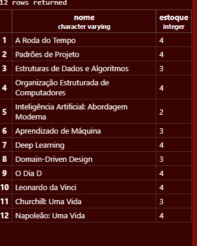
---

***11 passo***

Liste os livros publicados antes de 1900, ordenados do mais antigo para o mais recente.

Para realizar esse processo eu usei :

```sql
SELECT nome, ano_publicacao
FROM livros
WHERE ano_publicacao < 1900
ORDER BY ano_publicacao ASC;
```
***Porque?***

Por causa que eu estou especificando "selecione ano e publicação " Na tabela "FOM livros". Onde (quando) 'Ano de publicação é menor que 1900" e ORDER BY ano_publicacao ASC → organiza pelo ano, do mais antigo para o mais recente.
ASC significa ordem crescente.

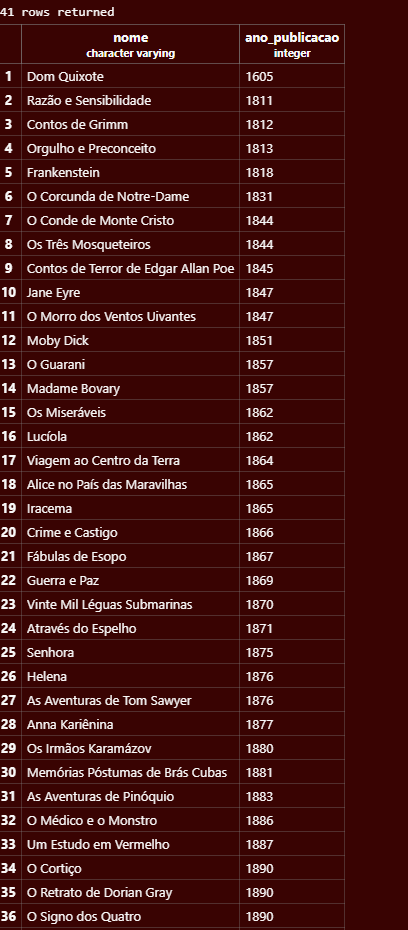


***12 Passo***

Liste os livros publicados entre 2010 e 2020, mostrando título, ano e gênero.

Para funcionar eu usei :

```sql
SELECT nome, ano_publicacao, genero
FROM livros
WHERE ano_publicacao BETWEEN 2010 AND 2020;
```
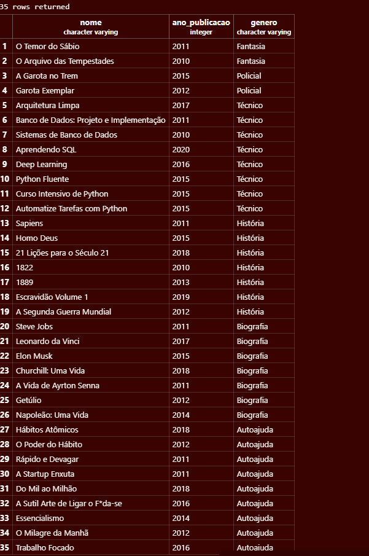

Neste código, utilizamos o SELECT para selecionar o nome, o ano de publicação e o género dos livros. O FROM indica que os dados serão retirados da tabela livros. Já o WHERE serve para filtrar os resultados, neste caso, mostrando apenas os livros publicados entre os anos de 2010 e 2020. Para isso, utilizamos o BETWEEN, que permite definir um intervalo de anos.


