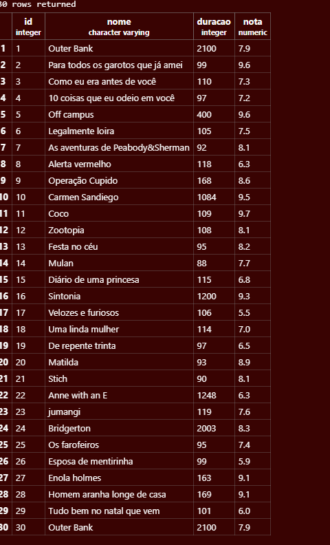

Para começar a escrevr a tabela eu usei o código

```sql
CREATE TABLE streaming (
    id INTEGER,
    nome VARCHAR(100),
    duracao INTEGER,
    nota NUMERIC
);
```

Primeiramente, realizei a conexão do PostgreSQL com o Visual Studio Code. Em seguida, criei uma tabela chamada streaming, que será utilizada para armazenar informações sobre filmes e séries.

Na criação da tabela, defini quatro colunas: id, que funciona como identificador de cada registro e é gerado automaticamente; nome, para armazenar o nome do filme ou série; duracao, para informar a duração em minutos; e nota, para armazenar a avaliação de cada título.

Depois, utilizei o comando INSERT INTO para inserir os 32 registros de filmes e séries na tabela.

Após a inserção dos dados, utilizei o comando SELECT * FROM streaming para consultar todos os registros cadastrados. Em seguida, fiz uma consulta utilizando apenas as colunas nome e nota, conforme solicitado na atividade.

Depois disso, utilizei o comando UPDATE para atualizar as notas de cinco filmes que já assisti:
```sql
UPDATE streaming
SET nota = 10
WHERE nome = 'Outer Bank';

UPDATE streaming
SET nota = 10
WHERE nome = 'legalmente loira';

UPDATE streaming
SET nota = 9
WHERE nome = 'Uma linda mulher';

UPDATE streaming
SET nota = 8
WHERE nome = 'Stich';

UPDATE streaming
SET nota = 10
WHERE nome = 'Matilda';
```

Por último, utilizei o comando DELETE para apagar os cinco registros que possuíam as menores notas da tabela, simulando a exclusão de dados devido à falta de espaço no SSD. Ao final, realizei novamente uma consulta com SELECT * FROM streaming para visualizar os registros restantes.

E aqui em baixo tem as fotos de toda a criação:



