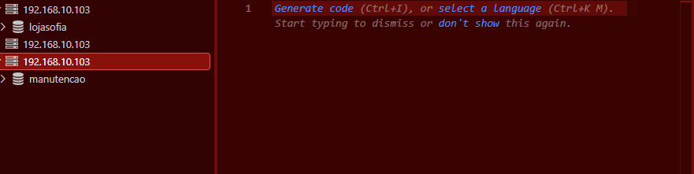
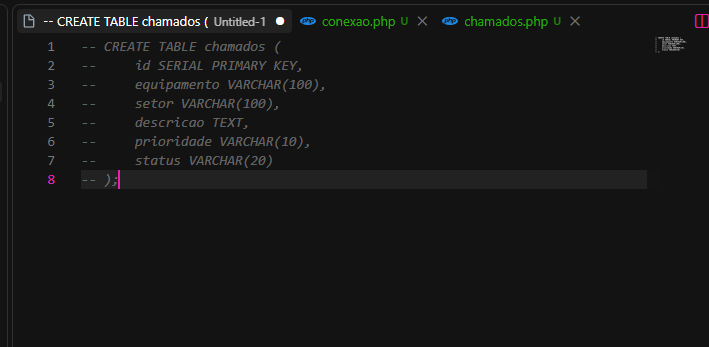
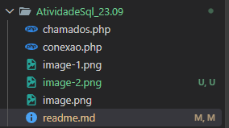
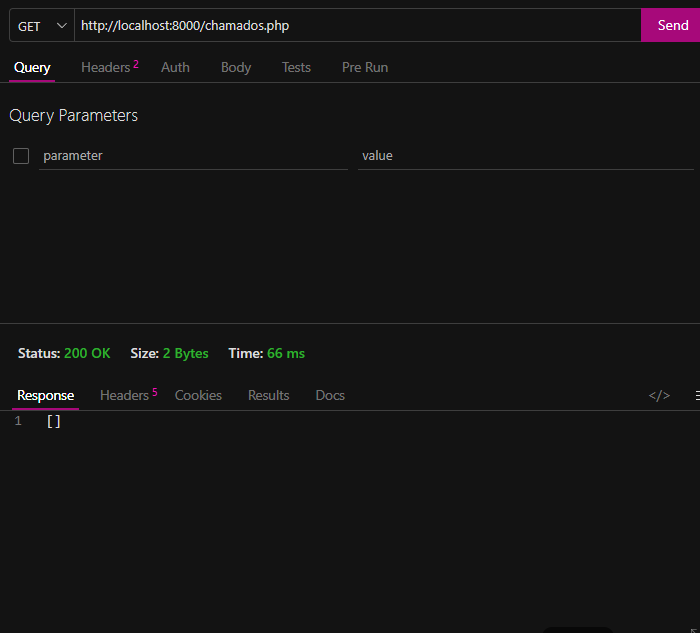
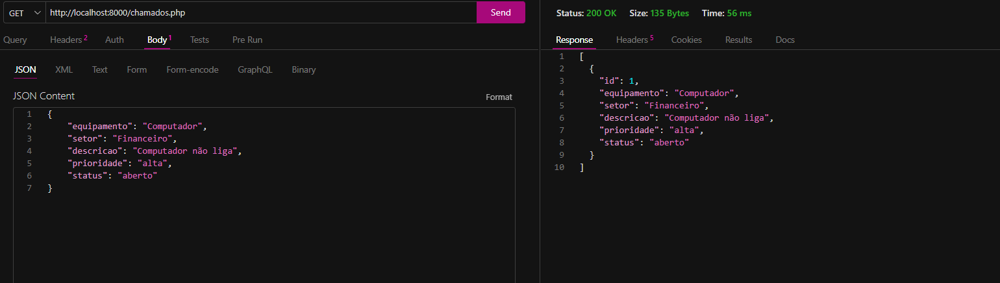

### Trabalho API ###
Este projeto consiste no desenvolvimento de uma API em PHP para controle de chamados de manutenção de equipamentos.

A proposta surgiu da necessidade de uma empresa organizar melhor os problemas de manutenção, que anteriormente eram registrados por mensagens ou anotações em papel. Com a API, é possível cadastrar, consultar, atualizar e excluir chamados de forma mais organizada.

### Estrutura da tabela

Campo

Descrição

id

Identificador único do chamado

equipamento

Equipamento que apresenta o problema

setor

Setor onde o equipamento está localizado

descricao

Descrição do problema

prioridade

Nível de urgência do chamado

status

Situação atual do chamado

### Estrutura do projeto 
PROJETO-CRUD/
│
├── conexao.php
├── chamados.php
└── README.md

---

1-Primeiro eu comcei craiando a tabela lá no moba

2-Depois realizei a conexão aqui pelo vs code. 

3- Criei a tabela com o nome "chamdos"

4- E criei dois arquivos dentro da minha pasta AtividadeSql_23.09:

5- Depois de colocar os códigos eu testei no Tunder Clad:

