###  Atividade Prática - API e Consultas          ###
Para começar a atividade eu entrei no postgres do root e crie o arquivo.

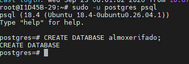

Depois que eu conectei o arquivo com o vs code eu começo a realizar os códigos para criar a tabela : 

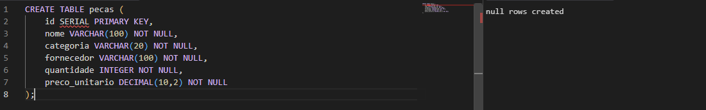

> Importante sempre lembrar de apertar o `F5` as vezes eu esqueço ou aperto duas vezes.

Agora para continuar eu crie dentro da minha pasta `Atividade_30.09` al´ém do `README.php` dois arquivos muito importantes o `conxao.php` e o `pecas php`.

Sendo que cada um possui uma função diferente dentro da API. O arquivo conexao.php é responsável por fazer a conexão entre o PHP e o banco de dados almoxarifado, permitindo que a aplicação consiga acessar e modificar os dados armazenados. Já o arquivo pecas.php é responsável pelas operações da API, como cadastrar, listar, atualizar e excluir as peças. Dessa forma, separar os arquivos deixa o projeto mais organizado, facilita a manutenção do código e permite que a conexão com o banco seja utilizada pela API sempre que necessário.

>Arquivo:conexao.php

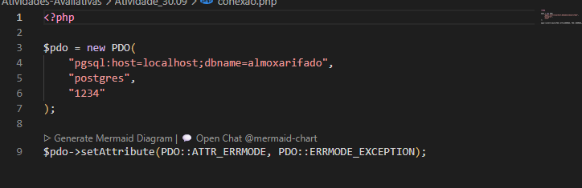

>Arquivo:pecas.php
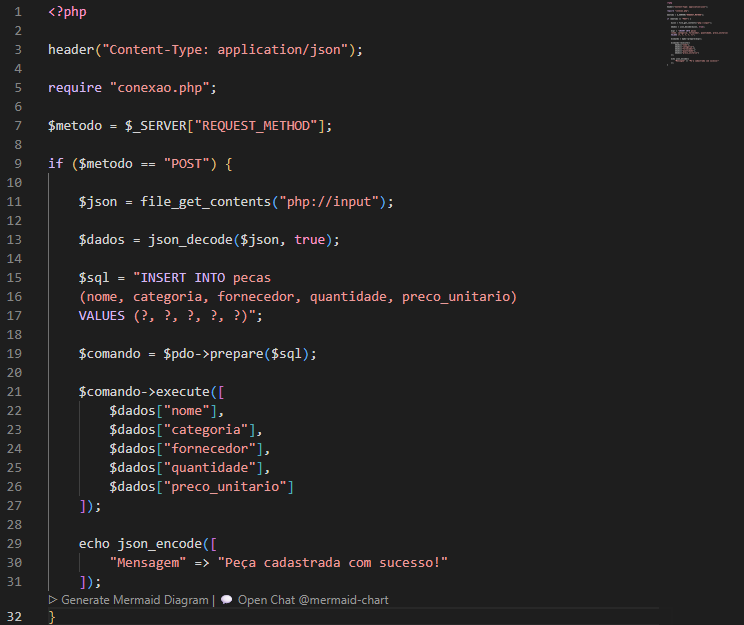

Depois eu vou comecar com o json. Coloco em post para cadastrar a informação e abro a porta no terminal do vs code 8080 dentro da pasta que eu estou e no próprio link do post.
Depois é só ir cadastrando os materias um por um e apertando send. 

Mas eu acabei cometendo alguns errinhos de porta senha e codígo.

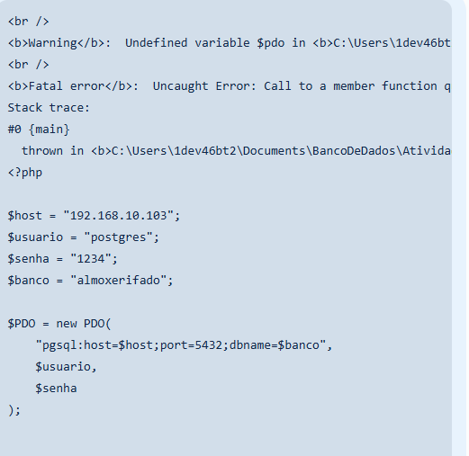

Então eu arrumei ficando assim : 

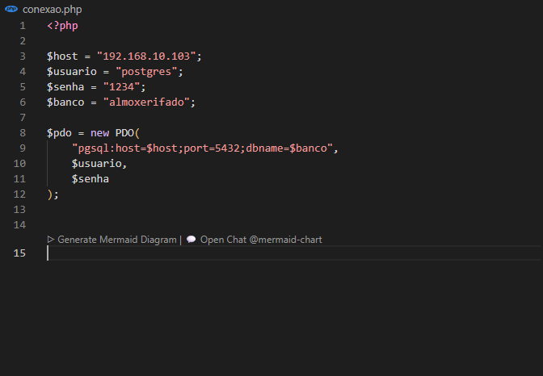

```php 
<?php

header("Content-Type: application/json");

require "conexao.php";

$metodo = $_SERVER["REQUEST_METHOD"];

/* POST - CADASTRAR */
if ($metodo == "POST") {

    $json = file_get_contents("php://input");
    $dados = json_decode($json, true);

    if (
        empty($dados["nome"]) ||
        empty($dados["categoria"]) ||
        empty($dados["fornecedor"]) ||
        !isset($dados["quantidade"]) ||
        !isset($dados["preco_unitario"])
    ) {
        echo json_encode([
            "mensagem" => "Preencha todos os campos obrigatórios"
        ]);
        exit;
    }

    if (
        $dados["categoria"] != "eletrica" &&
        $dados["categoria"] != "mecanica" &&
        $dados["categoria"] != "hidraulica"
    ) {
        echo json_encode([
            "mensagem" => "Categoria inválida"
        ]);
        exit;
    }

    if ($dados["quantidade"] < 0) {
        echo json_encode([
            "mensagem" => "A quantidade não pode ser negativa"
        ]);
        exit;
    }

    if ($dados["preco_unitario"] <= 0) {
        echo json_encode([
            "mensagem" => "O preço deve ser maior que zero"
        ]);
        exit;
    }

    $sql = "INSERT INTO pecas
            (nome, categoria, fornecedor, quantidade, preco_unitario)
            VALUES (?, ?, ?, ?, ?)";

    $stmt = $pdo->prepare($sql);

    $stmt->execute([
        $dados["nome"],
        $dados["categoria"],
        $dados["fornecedor"],
        $dados["quantidade"],
        $dados["preco_unitario"]
    ]);

    echo json_encode([
        "mensagem" => "Peça cadastrada com sucesso"
    ]);
}


/* GET - LISTAR */
elseif ($metodo == "GET") {

    $sql = "SELECT * FROM pecas";

    $stmt = $pdo->query($sql);

    $pecas = $stmt->fetchAll(PDO::FETCH_ASSOC);

    echo json_encode($pecas);
}


/* PUT - ATUALIZAR */
elseif ($metodo == "PUT") {

    $json = file_get_contents("php://input");
    $dados = json_decode($json, true);

    if (
        !isset($dados["id"]) ||
        empty($dados["nome"]) ||
        empty($dados["categoria"]) ||
        empty($dados["fornecedor"]) ||
        !isset($dados["quantidade"]) ||
        !isset($dados["preco_unitario"])
    ) {
        echo json_encode([
            "mensagem" => "Preencha todos os campos obrigatórios"
        ]);
        exit;
    }

    if (
        $dados["categoria"] != "eletrica" &&
        $dados["categoria"] != "mecanica" &&
        $dados["categoria"] != "hidraulica"
    ) {
        echo json_encode([
            "mensagem" => "Categoria inválida"
        ]);
        exit;
    }

    if ($dados["quantidade"] < 0) {
        echo json_encode([
            "mensagem" => "A quantidade não pode ser negativa"
        ]);
        exit;
    }

    if ($dados["preco_unitario"] <= 0) {
        echo json_encode([
            "mensagem" => "O preço deve ser maior que zero"
        ]);
        exit;
    }

    $sql = "UPDATE pecas
            SET nome = ?,
                categoria = ?,
                fornecedor = ?,
                quantidade = ?,
                preco_unitario = ?
            WHERE id = ?";

    $stmt = $pdo->prepare($sql);

    $stmt->execute([
        $dados["nome"],
        $dados["categoria"],
        $dados["fornecedor"],
        $dados["quantidade"],
        $dados["preco_unitario"],
        $dados["id"]
    ]);

    echo json_encode([
        "mensagem" => "Peça atualizada com sucesso"
    ]);
}


/* DELETE - EXCLUIR */
elseif ($metodo == "DELETE") {

    $json = file_get_contents("php://input");
    $dados = json_decode($json, true);

    if (!isset($dados["id"])) {
        echo json_encode([
            "mensagem" => "Informe o id da peça"
        ]);
        exit;
    }

    $sql = "DELETE FROM pecas WHERE id = ?";

    $stmt = $pdo->prepare($sql);

    $stmt->execute([
        $dados["id"]
    ]);

    echo json_encode([
        "mensagem" => "Peça excluída com sucesso"
    ]);
}
```

>Desse jeito 

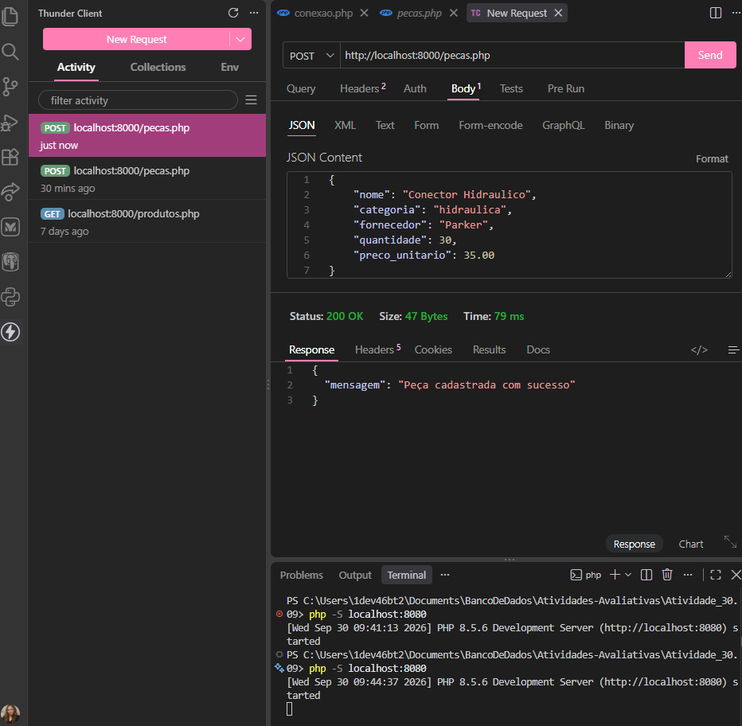

Para responder já as perguntas eu faço deireto na tabela usando :
* 1. Quantas unidades existem no almoxarifado? 

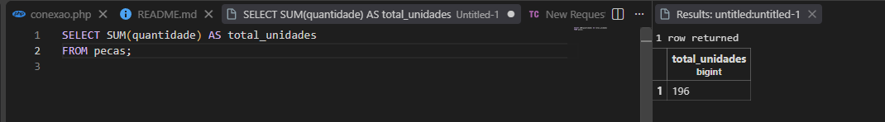

* 2. Qual é o valor total do estoque?

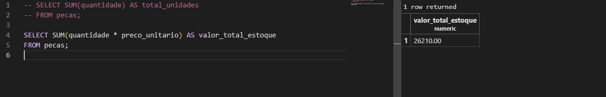

* 3. Qual é o preço unitário da peça mais cara?

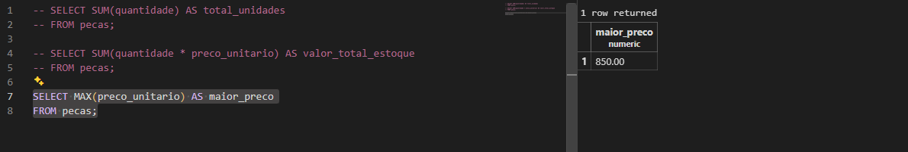

* 4. Qual é o preço unitário da peça mais barata?

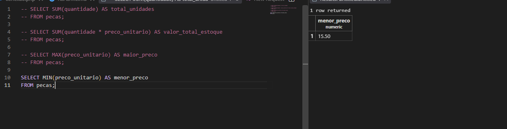

* 5. Qual é o preço médio das peças com duas casas decimais?

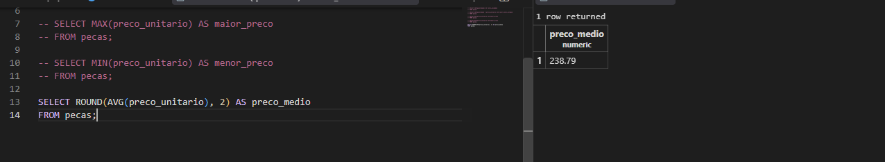

* 6. Qual é o valor total em estoque somente das peças elétricas?

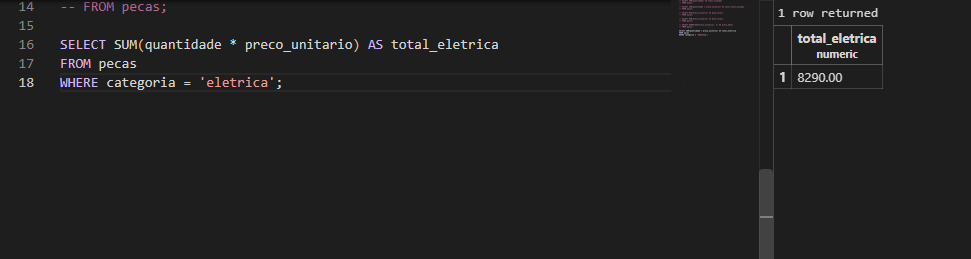