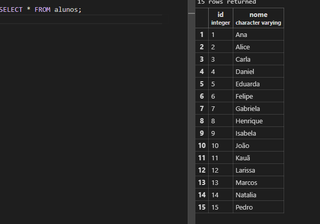
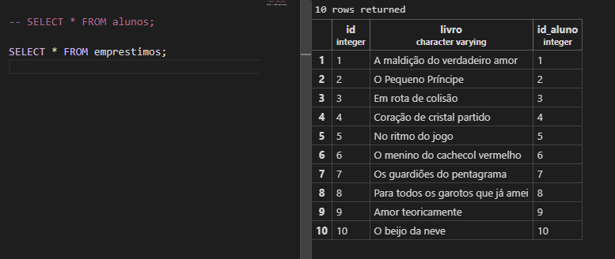
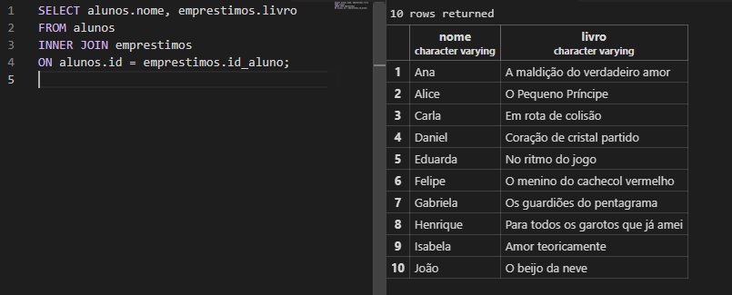
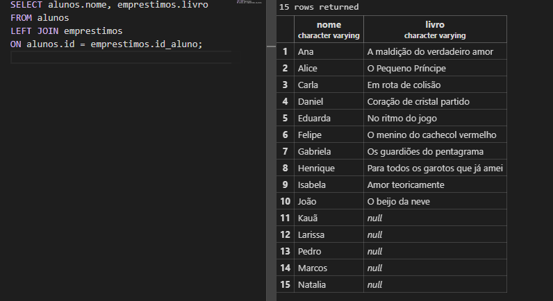
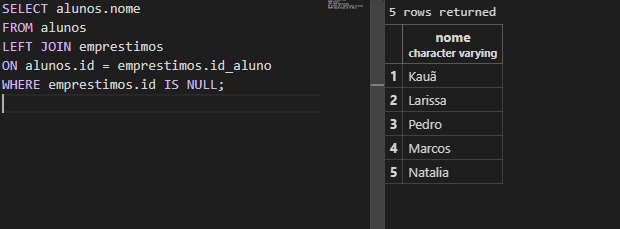

## Atividade Prática 11 - Relacionamnetos entre tabelas 

1-Primeiro eu crieu um arquivo no postgres:


E conectei com o meu vs Code:


2-Para começar eu criei 2 tabelas: Uma de alunos e uma de emprestimos.

```sql
CREATE TABLE alunos (
    id SERIAL PRIMARY KEY,
    nome VARCHAR(50) NOT NULL
);

CREATE TABLE emprestimos (
    id SERIAL PRIMARY KEY,
    livro VARCHAR(100) NOT NULL,
    id_aluno INTEGER NOT NULL,
    FOREIGN KEY (id_aluno) REFERENCES alunos(id)
);
```
3- Inseri o nome de 15 alunos na tabela alunos:
```sql
INSERT INTO alunos (nome) VALUES
('Ana'),
('Alice'),
('Carla'),
('Daniel'),
('Eduarda'),
('Felipe'),
('Gabriela'),
('Henrique'),
('Isabela'),
('João'),
('Kauã'),
('Larissa'),
('Marcos'),
('Natalia'),
('Pedro');
```
4- Inseri o nome de 10 livros na tabela empréstimos :
```sql
INSERT INTO emprestimos (livro, id_aluno) VALUES
('A maldição do verdadeiro amor', 1),
('O Pequeno Príncipe', 2),
('Em rota de colisão', 3),
('Coração de cristal partido', 4),
('No ritmo do jogo', 5),
('O menino do cachecol vermelho', 6),
('Os guardiões do pentagrama', 7),
('Para todos os garotos que já amei', 8),
('Amor teoricamente', 9),
('O beijo da neve', 10);
```
5- Para mostrar as tabelas:
```sql



6- Queremos mostrar nome do aluno + livro:


7- Agora queremos mostrar todos os alunos, mesmo aqueles que não pegaram livros:


>Para os alunos que não pegaram nenhum livro, a coluna livro aparece como NULL.

8- Para ver quem nunca pegou nenhum livro:



9-Tentar registrar empréstimo para o aluno 50:
```sql
INSERT INTO emprestimos (livro, id_aluno)
VALUES ('Em rota de colisão', 50);
```
> Não vai aparecer nenhum resultado porque não existe aluno com id = 50. 
Isso acontece por causa desta parte que colocamos na tabela:
```sql
FOREIGN KEY (id_aluno) REFERENCES alunos(id)
```
> A FOREIGN KEY faz com que id_aluno só possa receber um número que já exista na tabela alunos.
