*** Anotações Da Atividade Prática do dia 09.09 ***

Para começar a atividade eu inseri todos os dados do professor na tabela. Aparecendo pra mi logó após inserid 1000 linhas dividas em 10 cada uma com 100. Porque o arquivo é muito grande. Para conseguir ver a tabela sem danificar o computador eu acabei selecionando as primeiras 100 linhas usando:

```sql
SELECT nome,preco 
FROM produtos LIMIT 100;
```

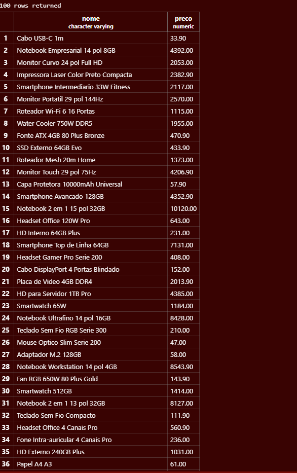
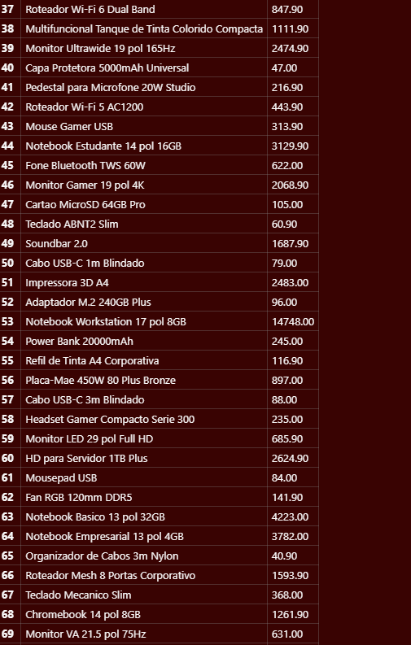
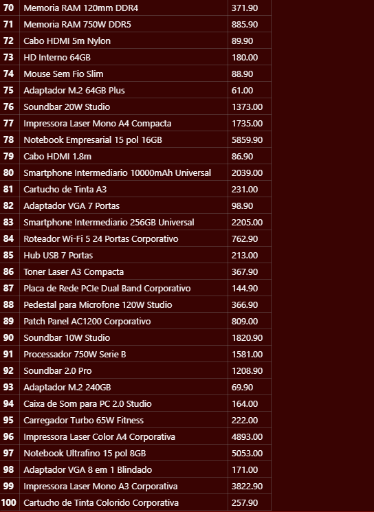

---

*** Parte A - Consultas e Filtros ***

1. Para começar a primeira parte vamos listar o nome e o preço de todos os produtos da categoria Monitores. Eu usei: 

```sql
SELECT nome, preco
FROM produtos
WHERE categoria = 'Monitores';
```
Sobre o código eu falei pro computador selecionar nome, preco na tabela produtos onde categoria é igual a Monitores

Assim o computador entende e ele responde com 100 produtos dentro dessa categoria:

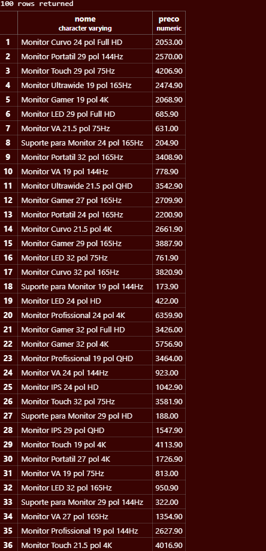
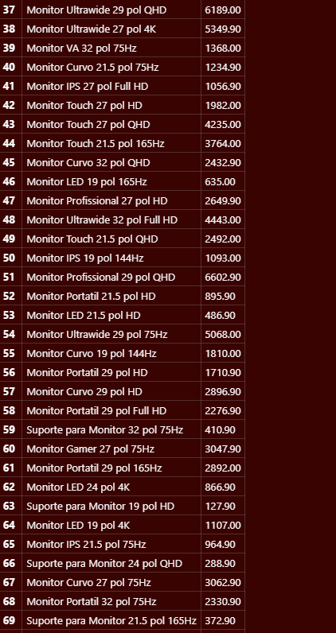
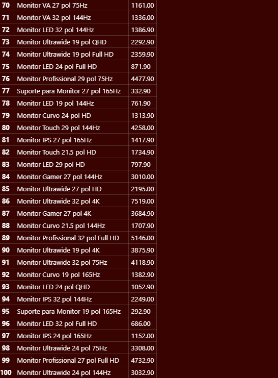
-

---

2. Para selecionar todos os produtos com estoque menor que 5 unidades, mostrando nome, categoria e estoqueeu usei :

```sql
SELECT nome, categoria, estoque
FROM produtos
WHERE estoque < 5;
```
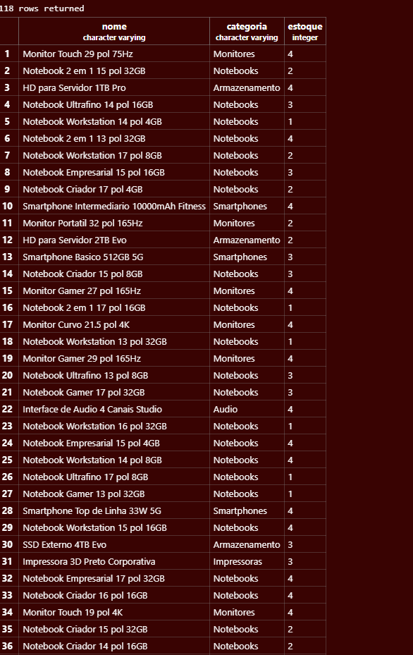
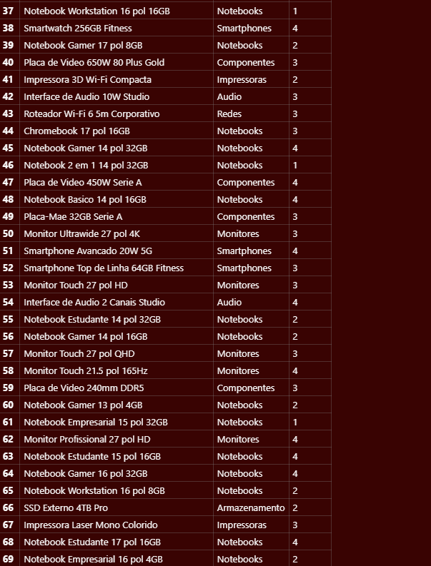
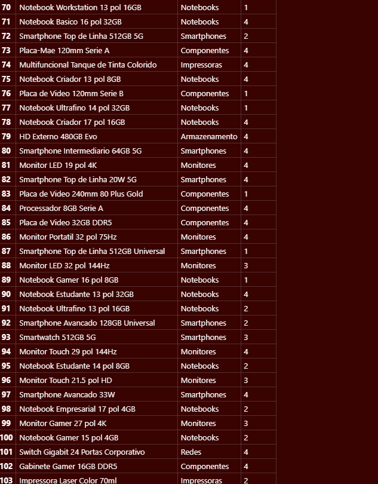
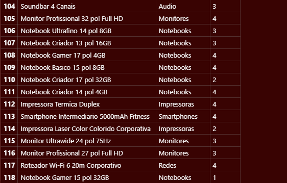

---

3. Para listar os 10 produtos mais caros da loja (nome e preço), do mais caro para o mais barato eu usei o :

```sql
SELECT nome, preco
FROM produtos
ORDER BY preco DESC
LIMIT 10;
```
Sobre o código eu selecionei o nome, preço dentro da tabela produtos em Ordem (ORDER BY) EM QUE PREÇO "DESC" desce, diminiu decrescente. Com limite de 10 produtos.

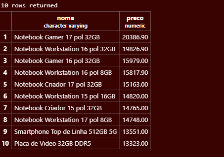

---

4. Esse é bem parecido para Listar os produtos da marca Logitech, ordenados por preço crescente.

```sql
SELECT nome, preco
FROM produtos
WHERE marca = 'Logitech'
ORDER BY preco ASC;
```
Eu apenas acrescento aonde a marca foi = a Logitech selecionar os produtos e preços. Lembra de colocar letra maiuscula no começo igual na tabela. 

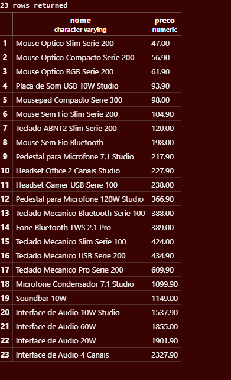

---

5. Para listar produtos entre valores eu usei :

```sql
SELECT nome, preco
FROM produtos
WHERE preco BETWEEN 100 AND 500;
```
é como se fosse um filtro de preço dos sites quando você vai comprar algo estipulndo o preço minímo emaxímo a ser gasto.

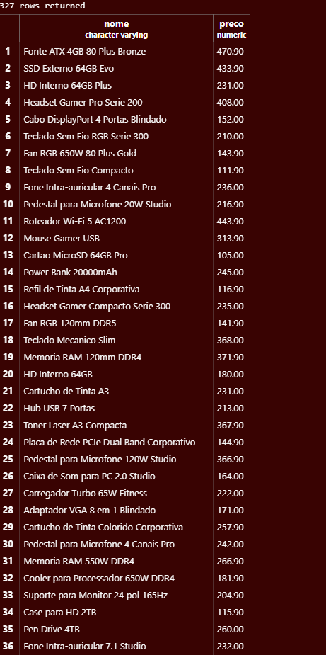
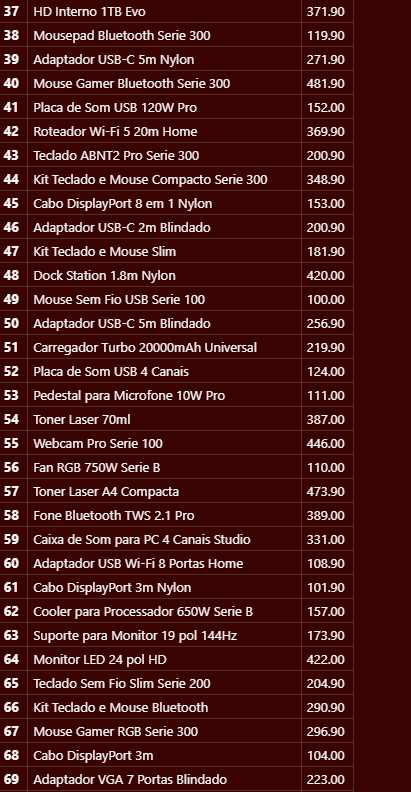
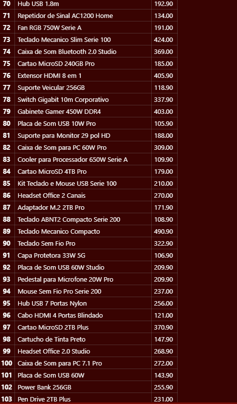
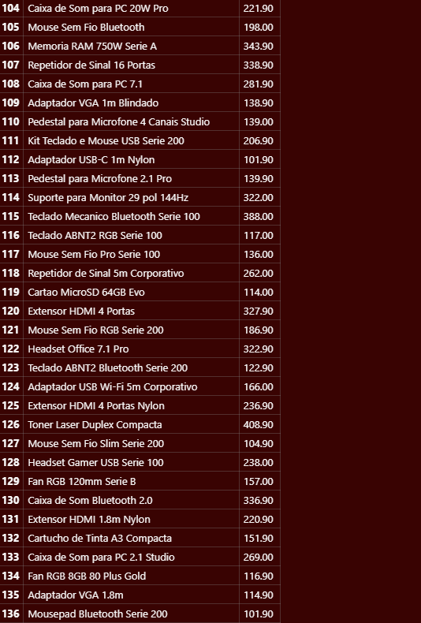
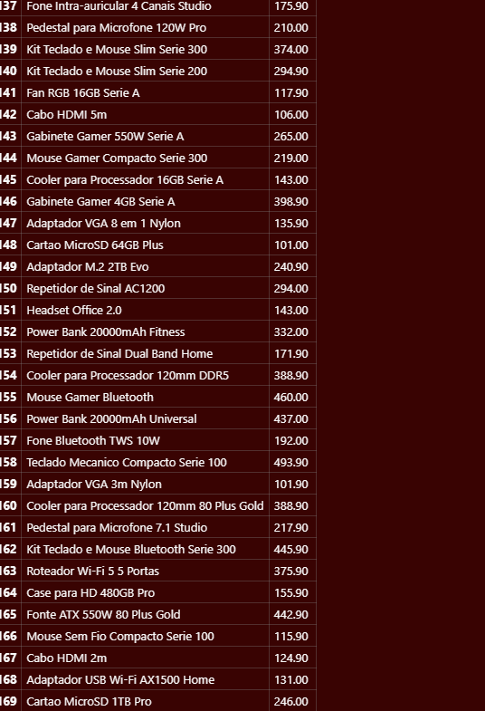
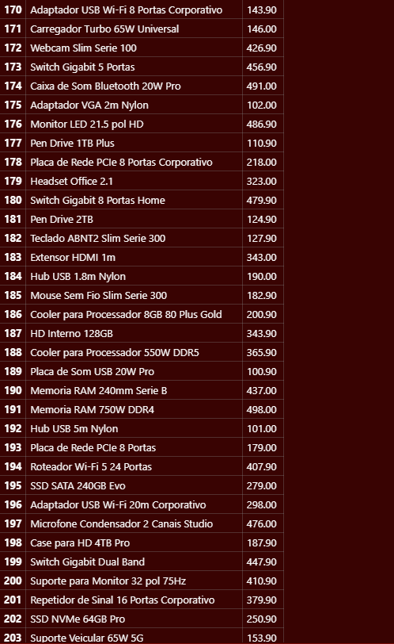
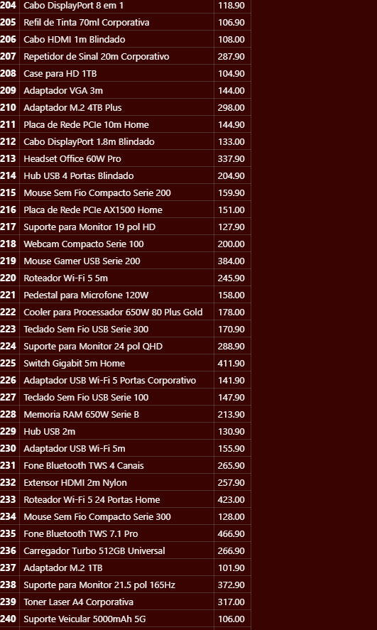
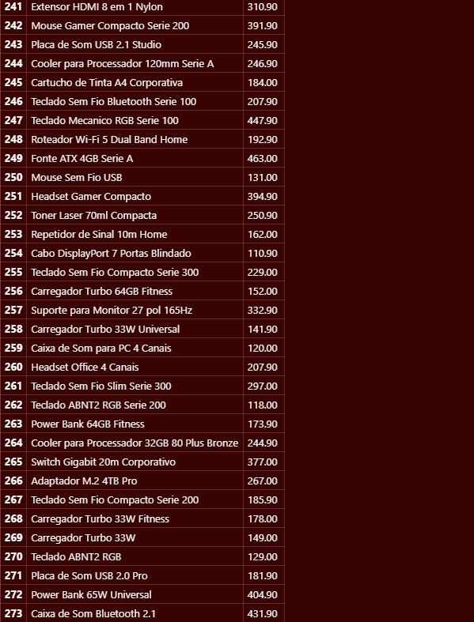
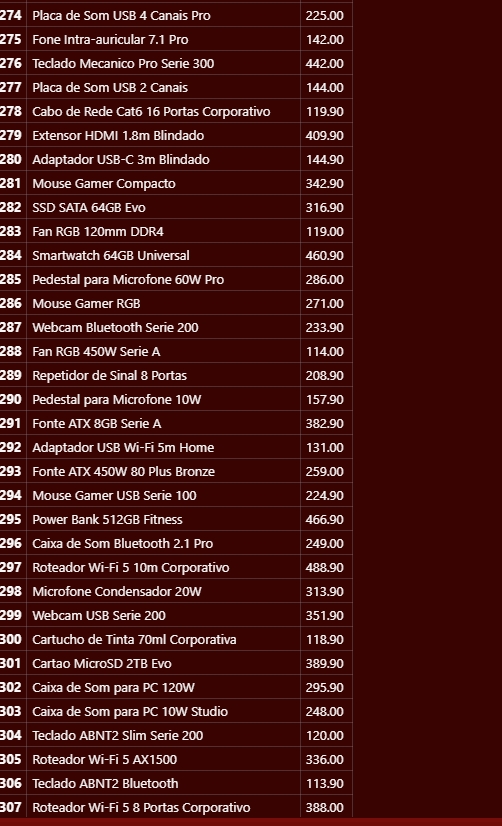
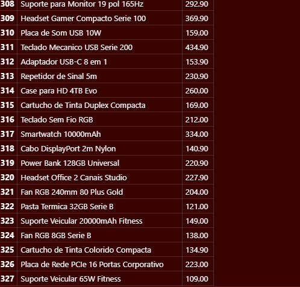

*** PARTE B FUNÇÕES DE AGREGAÇÃO ***

1. Quantos produtos existem cadastrados na loja? Dê ao resultado o nome total_de_produtos.
 
```sql
SELECT COUNT(*) AS total_de_produtos
FROM produtos;
```
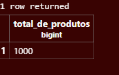

Esse foi fácil é só criar um COUNT (*) qua seleciona tudo e mostrar o nome da tabela como total_de_produtos

---

2. Quantos produtos estão com estoque abaixo de 10 unidades? Nomeie a coluna como produtos_em_falta.

```sql
SELECT COUNT(*) AS produtos_em_falta
FROM produtos
WHERE estoque < 10;
```
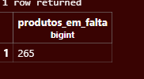

O resultado assim mostra que existem 265 produtos em falta que precisam repor.

---

3. Qual o maior e o menor preço da loja? Traga os dois na mesma consulta, com os nomes maior_preco e menor_preco.

```sql
SELECT 
    MAX(preco) AS maior_preco,
    MIN(preco) AS menor_preco
FROM produtos;
```
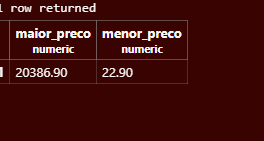

Esse codígo agente aprendeu agora antes do trabalho ksks.
---

4. Qual o preço médio dos produtos da categoria Notebooks, arredondado para 2 casas decimais?

```sql
SELECT ROUND(AVG(preco), 2) AS preco_medio
FROM produtos
WHERE categoria = 'Notebooks';
```
Esse código calcula o preço médio de todos os produtos da categoria Notebooks. O AVG(preco) faz a média dos preços e o ROUND(..., 2) arredonda o resultado para duas casas decimais. No final, encontramos um preço médio de R$ 6.458,38.

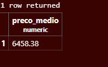

---

5. Quantas peças a loja tem no total, somando o estoque de todos os produtos? Nomeie como total_de_pecas.

```SQL
SELECT SUM(estoque) AS total_de_pecas
FROM produtos;
```
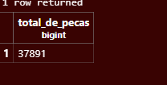


*** Parte C - PAINEL E CÁLCULOS ***

1.  Monte um painel resumo em uma única consulta, retornando de uma vez: quantidade de produtos, preço médio (2 casas decimais), maior preço, menor preço e total de peças em estoque. Todas as colunas devem ter nomes compreensíveis para o gerente.

```sql
SELECT
    COUNT(*) AS quantidade_de_produtos,
    ROUND(AVG(preco), 2) AS preco_medio,
    MAX(preco) AS maior_preco,
    MIN(preco) AS menor_preco,
    SUM(estoque) AS total_de_pecas
FROM produtos;
```
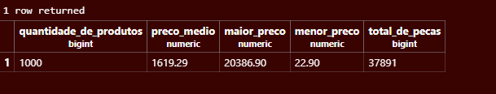

Esse código cria um resumo geral da loja em uma única consulta. Ele mostra a quantidade total de produtos, o preço médio, o maior preço, o menor preço e a quantidade total de peças em estoque. Para isso, são usadas as funções COUNT(), AVG(), MAX(), MIN() e SUM(). O ROUND() arredonda o preço médio para duas casas decimais.
---

2.O valor imobilizado de um produto não está gravado na tabela: ele precisa ser calculado (preço x estoque). Crie a coluna calculada valor_em_estoque e mostre os 5 produtos com maior valor imobilizado, exibindo nome, preço, estoque e o valor calculado.

```sql
SELECT
    nome,
    preco,
    estoque,
    preco * estoque AS valor_em_estoque
FROM produtos
ORDER BY valor_em_estoque DESC
LIMIT 5;
```
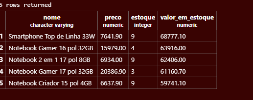

Esse código calcula quanto cada produto representa em dinheiro no estoque, multiplicando o preço pela quantidade disponível (preco * estoque). O resultado é chamado de valor_em_estoque. Depois, os produtos são organizados do maior para o menor valor e são mostrados apenas os 5 primeiros usando ORDER BY ... DESC e LIMIT 5.
---

3.Compare o resultado de C2 com o produto mais caro que apareceu em A3. É o mesmo item? Escreva duas linhas explicando o que essa comparação revela sobre o estoque da loja. 

Nessa questão, comparamos o produto mais caro da loja com os produtos que possuem maior valor em estoque. O produto mais caro não precisa ser o que possui maior valor em estoque, porque o valor em estoque depende tanto do preço quanto da quantidade disponível. Assim, um produto mais barato pode ter um valor total maior se tiver muitas unidades em estoque.

O produto mais caro da loja não é necessariamente o produto com maior valor em estoque.
Isso acontece porque o valor em estoque depende do preço e também da quantidade disponível.