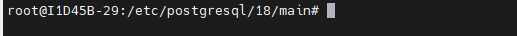

## SGBD
Instalar e configurar o SGBD PostgresSQL

Comando para instalar o SGBD:

```bash
sudo apt install -y postgresql
```
>Obs:O comando sudo, no nosso caso, pode ser omitido pois já somos root.
---
Realizando verificação do SGBD:
```bash
pg_lsclusters
```

Para realizar o acesso ao SGBD **sem senha**,
utilizar o comando:

```bash
sudo -u postgres psql
```
>Com esse comando o acesso é feito sem senha ,pois o Linux já provou quem você é para o (root).
Autentificação PEER

Para primeiro acesso,alterei a senha;

```SQL
alter user POSTGRES password '27032010'
```

>O retorno correto, é `ALTER ROLE`.

---
```bash
Porta do banco de dados: 543
sudo -u (usúario)
sudo -u postgres psql (trocou usúario. Entrei dentro do banco de dados)
```

Sempre que você quiser sair do postgress, comando `/q` (igual o \quit de vários jogos)

## Importante 
Entrar no PostgreSQL pelo VS Code (usando extensões oficiais ou ferramentas como o SQLTools) é bom porque centraliza o trabalho em uma única tela. Você escreve códigos, testa comandos SQL, navega pelas tabelas e gerencia dados sem precisar abrir programas pesados externos


```mermaid
graph LR
A[sudo psql -h 127.0.0.1 -U postgres]
--<b>Autentificação</b>-->B[funciona vindo de qualquer maquina, porém é necessário inserir a senha]
````
## Configurações de serviço
Caminho padrão para as configurações do Postgres 


Primeira configuração:
```bash
sudo nano
postgresql.conf
```
CTRL + w para buscar a linha do listen_addresses e descomentamos.
Se ficar localhost,somente o meu PC acessa.

Passo: 
```bash
sudo nano pg_hba.conf
````

Nas ultímas linhas,adicionei:
host, all, all, 10.87.38.0/24 scram-sha-256

Para criar um banco de dados usamos o comando :
````sql
CREATE DATABASE lojamax:
````
-------
Para visualizar os bancos:
````bash
\l
`````

Para sair:
```
Bash
```