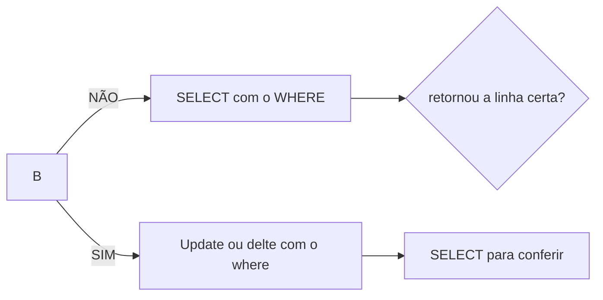

## AULA 05
Para filtrar colunas, utilizamos o comando:

```sql
SELECT nome,população FROM maiorescidades;
```
Para filtro de registros, utilizamos o comando:
```sql 
SELECT * from produtos 
WHERE estoque < 10;
```
Para ordenar os dados:
```sql
SELECT nome,preço FROM produtos
ORDER BY preço DESC;
```
---
**UPDATE**: update ou delete sem `WHERE` atinga todas As linhas! não exite crtl+z:(

Fluxo seguro (sempe)


Tambem é possível realizar cálculos;
```sql
UPDATE = cidades
SET populacao = populacao -7420
WHERE nome ='Daca';
```

**DELTE**:
Para apagar registros:
```sql
DELETE FROM cidades
WHERE nome='Daca';