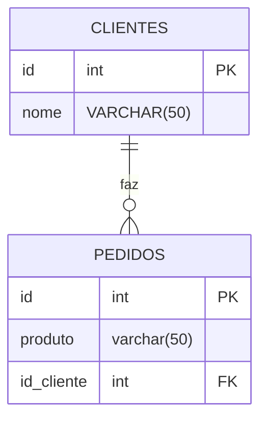
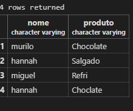

## Relacionamentos entre tabelas

- Ideia principal: Um cliente pode possuir vários pedidos. 

## Diagrama
Entidade Relacionamento

1-Primeiro,criamos a nossa tabela:

```sql
CREATE TABLE clientes(
    id SERIAL PRIMARY KEY,
    nome VARCHAR(50) NOT NULL
);
```
2- Craimos ID da tabela clientes:
`REFERENCES` é muito importante porque vai conectar as tabelas é como entender uma referância do livro.
```sql
CREATE TABLE pedidos(
    id SERIAL PRIMARY KEY,
    produto VARCHAR(50) NOT NULL,
    id_cliente INT REFERENCES clientes(id)
);
```
3-Inserimos clienets em nossa tabela clientes:
```sql
INSERT INTO clientes(nome) VALUES
('hannah'),
('miguel'),
('murilo'),
('lucas');
```
4- Inserimos os pedidos e seus respectivos clientes:
```sql
INSERT INTO pedidos(produto,id_cliente) VALUES('Chocolate',3),
('Salgado',1),
('Refri',2),
('Choclate',1)
```
--- 
Para ver as tabelas:

```
SELECT * FROM pedidos;
SELECT * FROM clientes;
```

Para excluir:
```
DELECT * FROM pedidos;
```
5- Para relacionar as tabelas:
```sql
SELECT clientes.nome,pedidos.produto
FROM pedidos
INNER JOIN clientes ON pedidos.id_cliente = clientes.id;
```


6- Para verificar todos os clientes,até mesmo aqueles que não compraram nada:
`INNER JOIN`- Só pega clientes que fizeram pedidos (Pegar o meio das circunferências)
`LEFT JOIN`- Eu quero ver toda a minha parte da esquerda, pego todos os tabelas 
``
```
SELECT clientes.nome,pedidos.produto
FROM clientes
LEFT JOIN pedidos ON pedidos.id_cliente = clientes.id;
```
7- Mostrar apenas aqueles que não compraram nada:
```sql
SELECT clientes.nome,pedidos.produto
FROM clientes
LEFT JOIN pedidos ON pedidos.id_cliente = clientes.id
WHERE pedidos.id IS NULL;
```
8- 