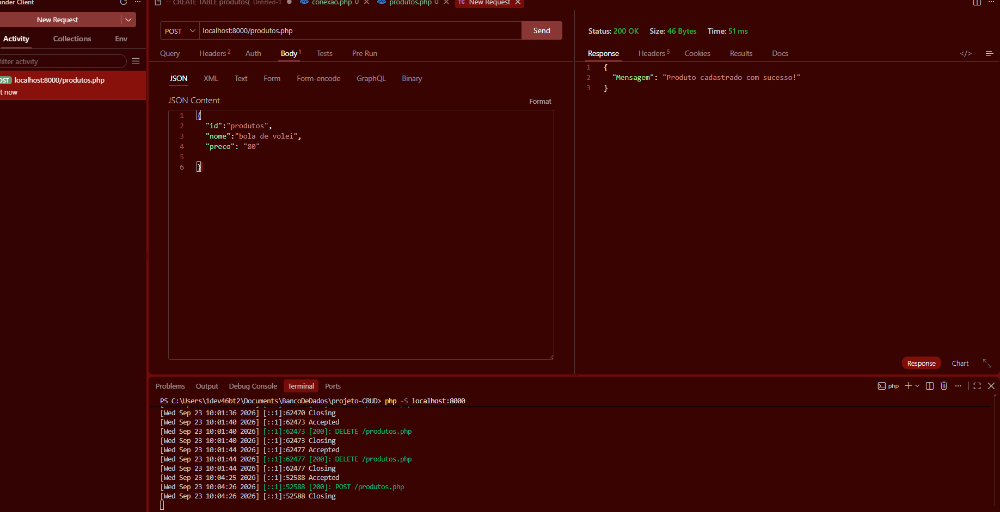

Para entender melhor pense que você tem um cachorro. Você não sabe como ele vai ficar, Porém você sabe que ele vai fazer tudo que um cachorro faria. No codígo é o mesmo racíocinio:

> Zeus = new cachorro

> Zeus -> latir()

> Zeus -> Dormir()

>  Zeus -> Comer chinelo ()

 Só que uma pessoa consegue fazer algo que um cachorro faz  se ele quiser então para simplificar a rota podemos também.
Para que por exemplo eu não precise colocar objeto "Platini" como = categoria de novo cachorro.

> platini(cachorro::Latir)
Eu simplifico a rota do processo 

